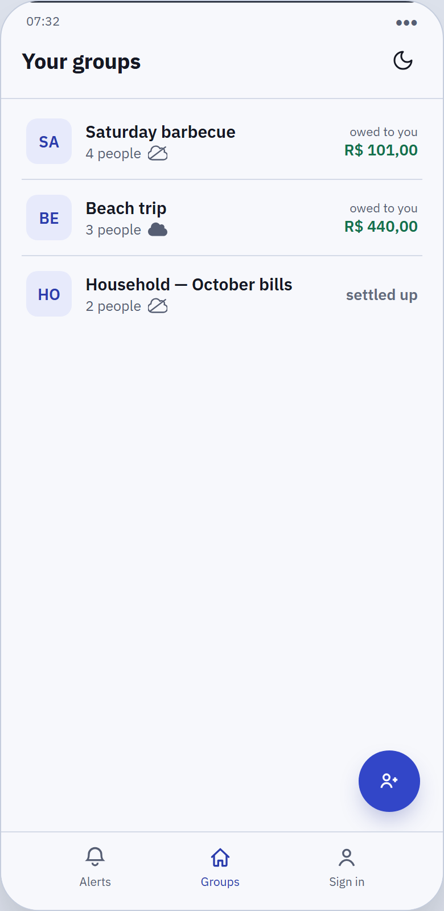
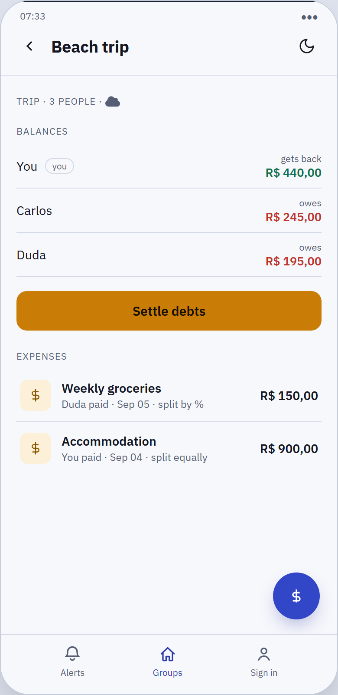
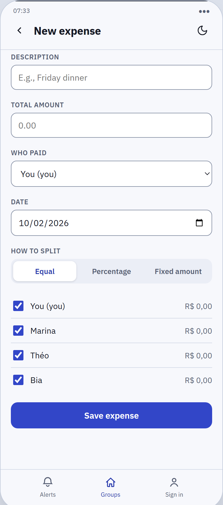
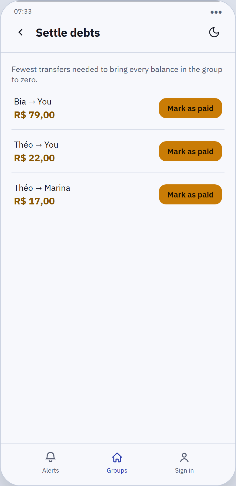
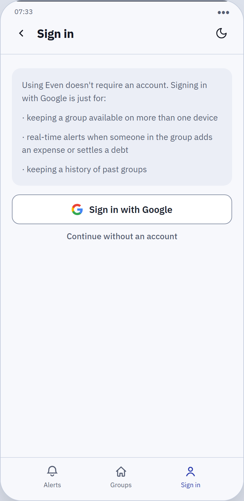
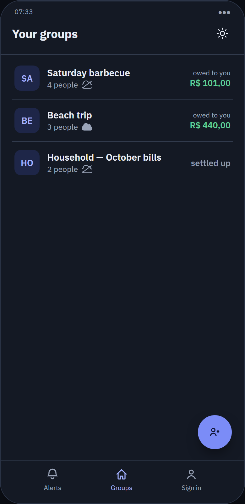

# Even

Group expense-splitting app (Splitwise-style), built local-first around a real debt
simplification algorithm (balance graph, minimizing the number of transactions needed to
settle a group) instead of a naive who-owes-whom ledger. Published in Brazilian Portuguese
as **Tô Quite**.

## Screens

Captures from the design prototype (HTML/CSS/JS), with the same visual fidelity replicated in
the native Android app.

<table>
<tr>
<td align="center"><br><sub>Your groups</sub></td>
<td align="center"><br><sub>Group details</sub></td>
<td align="center"><br><sub>New expense</sub></td>
</tr>
<tr>
<td align="center"><br><sub>Settle up (simplification algorithm)</sub></td>
<td align="center"><br><sub>Optional Google sign-in</sub></td>
<td align="center"><br><sub>Light/dark theme</sub></td>
</tr>
</table>

Cool-slate neutrals with an indigo brand colour, plus an amber accent reserved for money
changing hands (settle-up actions, settlement amounts, totals); debts show in coral and
credits in green. The theme follows the system setting by default, and the toggle in the top
bar overrides it.

## Download the app

Debug APK, ready to install (Android 8+), for anyone who wants to try it without building:

**[⬇ Download even-debug.apk](../../releases/latest/download/even-debug.apk)**

It's a debug build, not published on the Play Store — Android will warn about an unknown
source on install; just confirm. It ships with a sample group (local, not synced) so you can
explore the screens without creating anything from scratch.

## Architecture

- **Native Android app (Kotlin)** — works fully offline, no account: create a group, add
  participants by name only, log expenses, and see the simplification, all local (Room/SQLite).
  Login is optional, never required to use the app.
- **Backend (.NET + SignalR)** — only used for groups the user chooses to sync. The debt
  simplification engine runs server-side as a pure algorithm over a balance graph, decoupled
  from EF Core/controllers, and the same logic is replicated in Kotlin for offline groups.
- **Authentication** — Google Sign-In (OAuth 2.0/OIDC), no self-managed password system.
- **Real-time notifications** — via a SignalR hub, no third-party push (FCM/APNs).
- **Static prototype** (`prototype/`) — clickable HTML/CSS/JS, no backend, used as a visual
  reference before the native implementation. Its stylesheet is also the source of truth for
  the colour palette; `app/tools/verify_palette.py` checks the Compose theme against it.

## Structure

```
backend/    .NET solution (Even.Domain / Even.Application / Even.Infrastructure / Even.Api + tests)
app/        native Android app (Kotlin, com.even.app), app/domain/data modules
prototype/  clickable static prototype (HTML/CSS/JS)
```

## Building and testing

```
cd backend && dotnet build && dotnet test     # 85 tests
cd app && ./gradlew assembleDebug test        # 166 unit tests
```

The Android build needs an `app/local.properties` with `sdk.dir` and the
`EVEN_GOOGLE_WEB_CLIENT_ID` / `EVEN_API_BASE_URL` placeholders.
